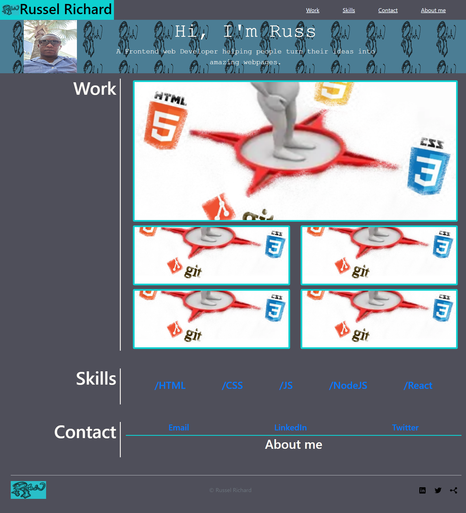

# Bootstrapping

## Description
This repo covers the creation of a portfolio page using bootstrap. The aim was to utilise bootstrap to minimise the workload of creating a webpage. This also showcases my skills and talents to employers looking to fill a part-time or full-time position. The portfolio highlights some of my strongest work as well as the thought processes behind it.

Skills covered include: html, flexbox, bootstrap, css, media queries and css variables. 
 
 

## Usage
To use this webpage, click on the following link: https://russkinori.github.io/Bootstrap-Portfolio/.

A browser window will open and load the webpage. You can then navigate through the page by clicking on the links within the header (top right of the page). **Work** - will take you to the projects that I have completed, **Skills** - will show you how I may best service your needs and **Contact Me** - to find out more about me and get in touch. You are also able to scroll through the webpage using either your mouse or the arrow keys on your keyboard. Clicking on any of the **Social Media** links within the **Contact Me** section, at the bottom of the page, will open a new tab to my profile on the respective website.

A visual representation of the webpage can be seen in the screenshot below.

 
 

## Credits
Material used to facilitate the learning experience is listed below: 
- https://www.geeksforgeeks.org/how-to-change-navigation-bar-color-in-bootstrap/
- https://getbootstrap.com/docs/4.0/layout/grid/
- https://developer.mozilla.org/en-US/docs/Web/HTML/Attributes/rel
- https://www.30secondsofcode.org/css/s/hover-additional-content
- https://www.freecodecamp.org/news/a-quick-guide-to-styling-buttons-using-css-f64d4f96337f/
 
 

## License
Licensed under the [MIT](./LICENSE)

